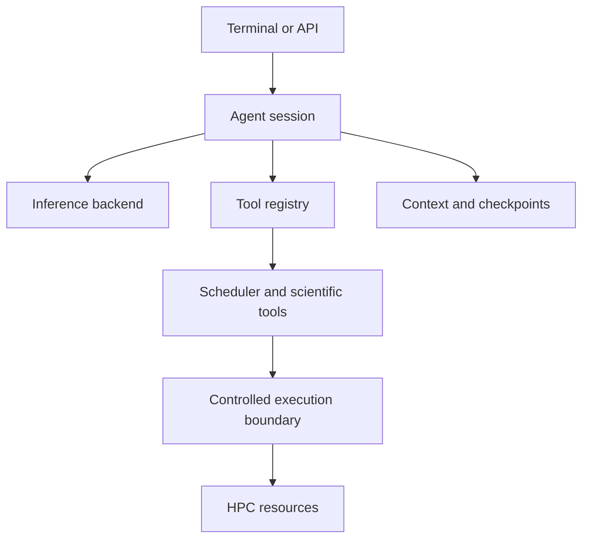

# Chaai architecture

The agent owns conversation and planning state. Inference backends provide model responses. Typed tool schemas constrain intended actions. Checkpoints preserve resumability. A production execution boundary must independently enforce permissions; prompt instructions alone are not a security control.

