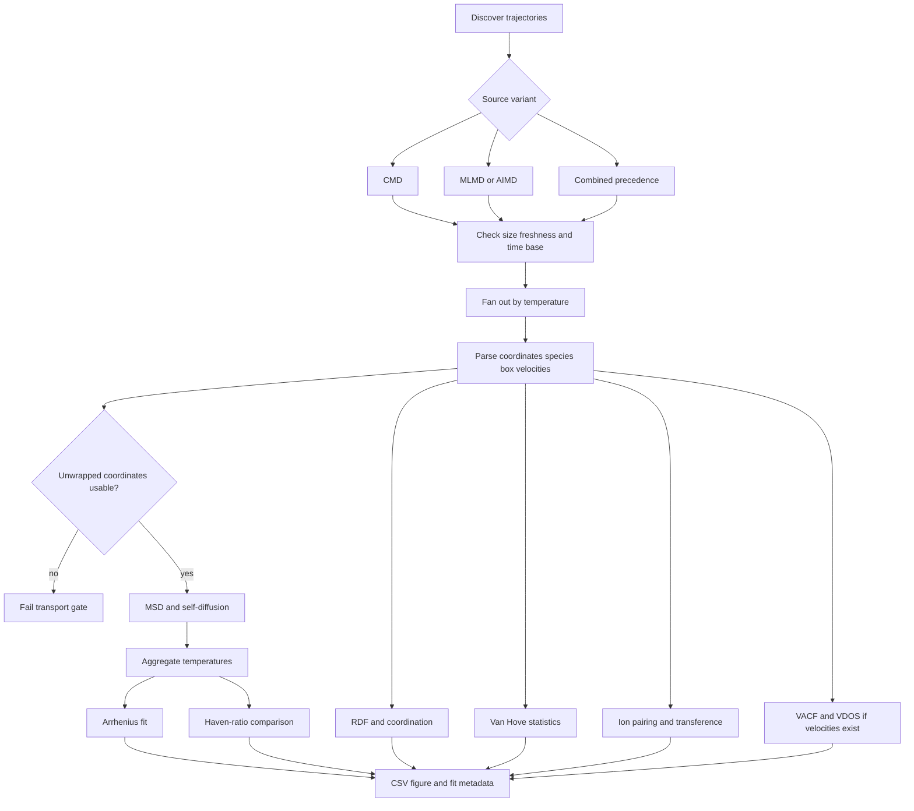

# Analysis and mathematics

HPCA converts trajectories into transport and structural observables while retaining the source, temperature, time spacing, species selection, fit choices, tables, and figures. The current orchestrator evaluates three named source variants:

- `cmd`: classical molecular-dynamics trajectories;
- `mlmd_dft`: MLMD where available, otherwise AIMD at that temperature;
- `combined`: MLMD, then AIMD, then classical MD in precedence order per temperature.

A combined series can mix simulation methods. Any fit over it must disclose that fact and should be treated as a sensitivity study unless comparability has been established.

## Analysis control flow

## Trajectory and time-base gate

For frame \(k\), physical time is

\[
t_k=k\,\Delta t_{\mathrm{frame}}, \qquad
\Delta t_{\mathrm{frame}}=\Delta t_{\mathrm{step}}N_{\mathrm{dump}}.
\]

Displacement coordinates must be unwrapped across periodic boundaries. Wrapped coordinates create artificial jumps and invalidate long-time displacement. The [MDAnalysis MSD documentation](https://docs.mdanalysis.org/2.3.0/documentation_pages/analysis/msd.html) states the same requirement.

**Required record:** trajectory identity, source method, temperature, selected species, frame count, frame interval, periodic-cell convention, and discarded equilibration fraction.

## Mean-squared displacement and self-diffusion

For \(N\) selected ions and lag \(\tau\),

\[
\mathrm{MSD}(\tau)=\left\langle\frac{1}{N}\sum_{i=1}^{N}
\left|\mathbf r_i(t_0+\tau)-\mathbf r_i(t_0)\right|^2
\right\rangle_{t_0}.
\]

In \(d\) diffusive dimensions, the Einstein relation is

\[
D_{\mathrm{self}}=\frac{1}{2d}\frac{d\,\mathrm{MSD}}{d\tau};
\qquad d=3 \Rightarrow D_{\mathrm{self}}=\frac{m}{6}.
\]

The current handler converts its fitted slope using

\[
D[\mathrm{m}^2/\mathrm{s}]=\frac{m[\text{Å}^2/\mathrm{ps}]}{6}\times10^{-8}.
\]

The [LAMMPS diffusion guide](https://docs.lammps.org/Howto_diffusion.html) also derives diffusion from the MSD slope. Report the selected linear window, slope uncertainty, \(R^2\), number of time origins, and a block-sensitivity check. Exclude ballistic short times and poorly sampled long lags.

## Temperature dependence and activation energy

\[
D(T)=D_0\exp\!\left(-\frac{E_a}{k_{\mathrm B}T}\right),
\qquad
\ln D=\ln D_0-\frac{E_a}{k_{\mathrm B}}\frac{1}{T}.
\]

If \(m_A\) is the fitted slope of \(\ln D\) against \(1/T\),

\[
E_a=-m_A k_{\mathrm B},
\qquad k_{\mathrm B}=8.617333262\times10^{-5}\ \mathrm{eV\,K^{-1}}.
\]

**Quality gate:** use at least three defensible temperatures, report the fit interval and diagnostics, inspect residuals, and do not force one line across a phase transition or mechanism change.

## Radial distribution and coordination

For species \(a\) and \(b\),

\[
g_{ab}(r)=\frac{1}{N_a\rho_b}
\left\langle\sum_{i\in a}\sum_{j\in b}
\frac{\delta(r-r_{ij})}{4\pi r^2}\right\rangle,
\qquad \rho_b=\frac{N_b}{V}.
\]

The running coordination number is

\[
n_{ab}(r)=4\pi\rho_b\int_0^r g_{ab}(r')r'^2\,dr'.
\]

A first-shell coordination number normally uses the first minimum after the first RDF peak. Record the cutoff, bin width, frames, species mapping, and periodic-boundary treatment. These definitions follow the [MDAnalysis RDF reference](https://docs.mdanalysis.org/2.9.0/documentation_pages/analysis/rdf.html).

## Self Van Hove function

\[
G_s(r,t)=\frac{1}{N}\left\langle\sum_{i=1}^{N}
\delta\!\left(r-\left|\mathbf r_i(t_0+t)-\mathbf r_i(t_0)\right|\right)
\right\rangle_{t_0}.
\]

Unlike MSD, \(G_s\) exposes heterogeneous or hopping motion hidden by an average. Displaced peaks can suggest preferred hop distances, but interpretation requires site geometry and sampling evidence.

## Ion pairing

For configured cation–anion cutoffs,

\[
\mathrm{CIP}:r_{+-}<r_1,\qquad
\mathrm{SSIP}:r_1\le r_{+-}<r_2,\qquad
\mathrm{free}:r_{+-}\ge r_2.
\]

Record \(r_1\) and \(r_2\); do not leave them as unexplained constants. Fractions should include time variability or block uncertainty.

## Transference, conductivity, and Haven ratio

The independent-particle cation transference estimate is

\[
t_+^{\mathrm{NE}}=\frac{z_+^2c_+D_+}
{z_+^2c_+D_+ + z_-^2c_-D_-}.
\]

For a 1:1 monovalent electrolyte with equal concentrations,

\[
t_+^{\mathrm{NE}}=\frac{D_+}{D_+ + D_-}.
\]

The Nernst–Einstein conductivity is

\[
\sigma_{\mathrm{NE}}=\frac{F^2}{RT}\sum_i z_i^2c_iD_i.
\]

One Haven-ratio convention is \(H=D_{\sigma}/D_{\mathrm{tracer}}\), but the definition must be stated because reciprocal conventions exist. Independent-particle estimates neglect distinct ion correlations and must not be presented as fully correlated conductivity.

## VACF and vibrational density of states

\[
C_{vv}(t)=\frac{\langle\mathbf v(0)\cdot\mathbf v(t)\rangle}
{\langle\mathbf v(0)\cdot\mathbf v(0)\rangle},
\qquad
I(\omega)\propto\operatorname{Re}\int_0^{\infty}C_{vv}(t)e^{-i\omega t}\,dt.
\]

The frequency grid depends on velocity sampling. Report windowing, zero padding, normalization, trajectory length, and aliasing limits.

## Analysis acceptance matrix

| Check | Pass condition | Failure action |
| --- | --- | --- |
| Source identity | method and trajectory recorded | stop or mark provenance incomplete |
| Coordinates | unwrapped displacement coordinates | regenerate or unwrap correctly |
| Time base | step and dump interval resolve time | stop; do not infer silently |
| Species mapping | atoms match declared chemistry | correct type or element mapping |
| Sampling | stable block estimates | extend trajectory |
| MSD fit | diffusive window and diagnostics | revise fit or report no reliable \(D\) |
| Arrhenius fit | adequate temperatures; no regime break | split regimes or withhold \(E_a\) |
| RDF/CN | normalized RDF and declared cutoff | correct normalization or cutoff |
| Units | dimensional analysis recorded | fail the result |
| Reproducibility | data, figure, configuration, provenance coexist | regenerate missing artifacts |

!!! warning "Scientific validation remains a human responsibility"
    A completed handler means its computational contract passed. It does not establish convergence with system size, trajectory duration, electronic-structure choices, force-field fidelity, or experiment.
