# Handler reference

This page documents each HPCA handler family. Enabled handlers and dependencies vary with the project category and validated specification.

## Common handler contract

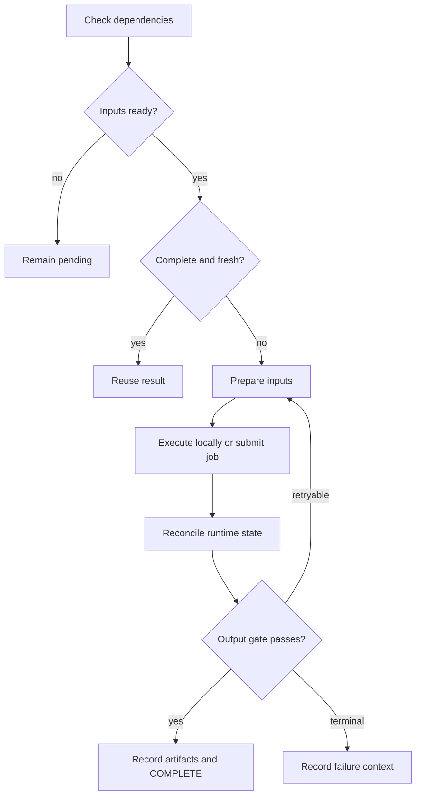

This separation between a handler and a handler run follows a common orchestration pattern: states belong to a particular execution, while the definition remains reusable. Comparable systems also expose retries, cached results, state histories, and persisted outputs; see [Prefect states](https://docs.prefect.io/v3/concepts/states) and [result persistence](https://docs.prefect.io/v3/advanced/results).

## h00 — Materials design

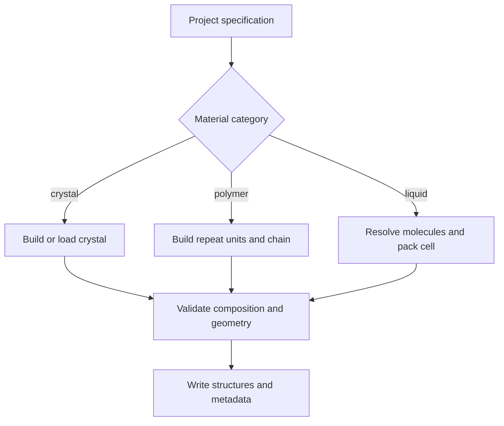

**Gate:** required species, composition, periodic cell, and usable geometry are present. **Outputs:** designed structures and downstream-ready structural inputs.

## h01 — DFT

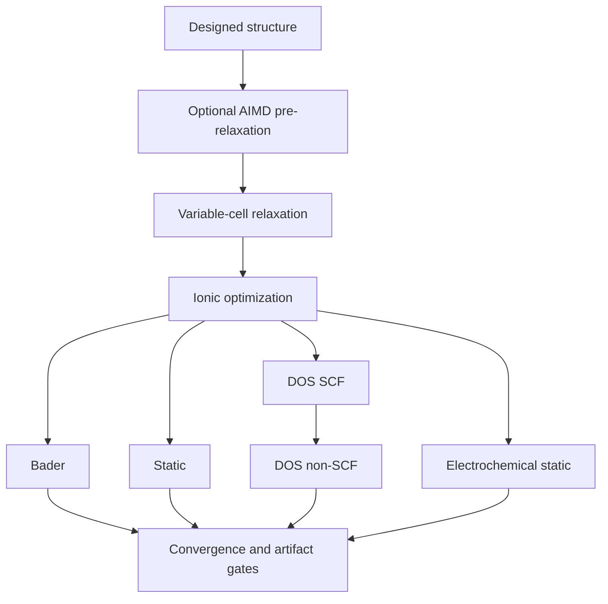

Each enabled subtask must produce its expected converged artifacts. Subtasks are independently tracked so valid work is not repeated unnecessarily.

## h02 — Ab initio molecular dynamics

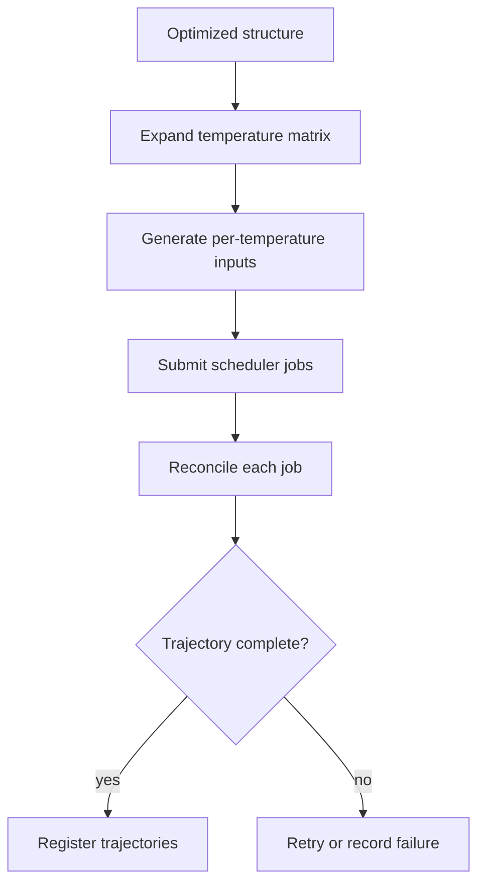

**Gate:** readable trajectories with adequate sampling coverage. Temperature jobs form a parallel execution set.

## h03 — Migration barriers with NEB

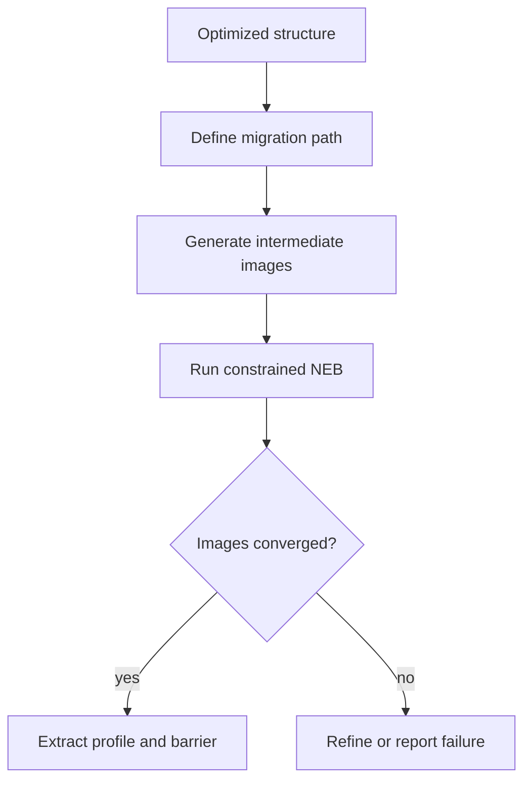

The forward barrier is \(E_m=\max_i E_i-E_0\). Acceptance also requires sensible image ordering and convergence.

## h04 — Machine-learned interatomic potential

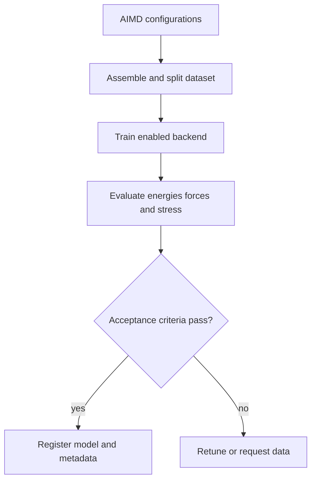

Validation must be independent of training data, and the model remains bounded by its declared chemical and thermodynamic domain.

## h05 — Classical MD and MLMD

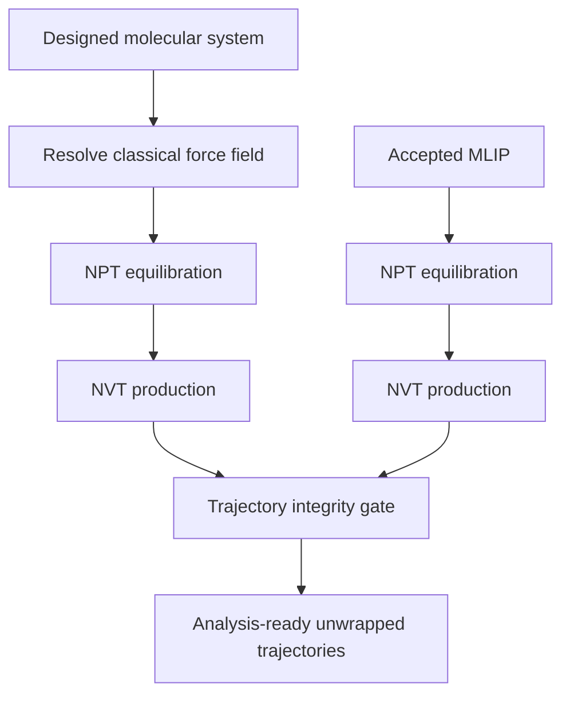

Classical MD and MLMD remain distinct sources so downstream comparisons do not silently treat different physical models as equivalent.

## h06 — Analysis

This handler fans out across data sources, temperatures, and observables. See [Analysis and mathematics](analysis-and-mathematics.md).

## h07 — Electronic analysis

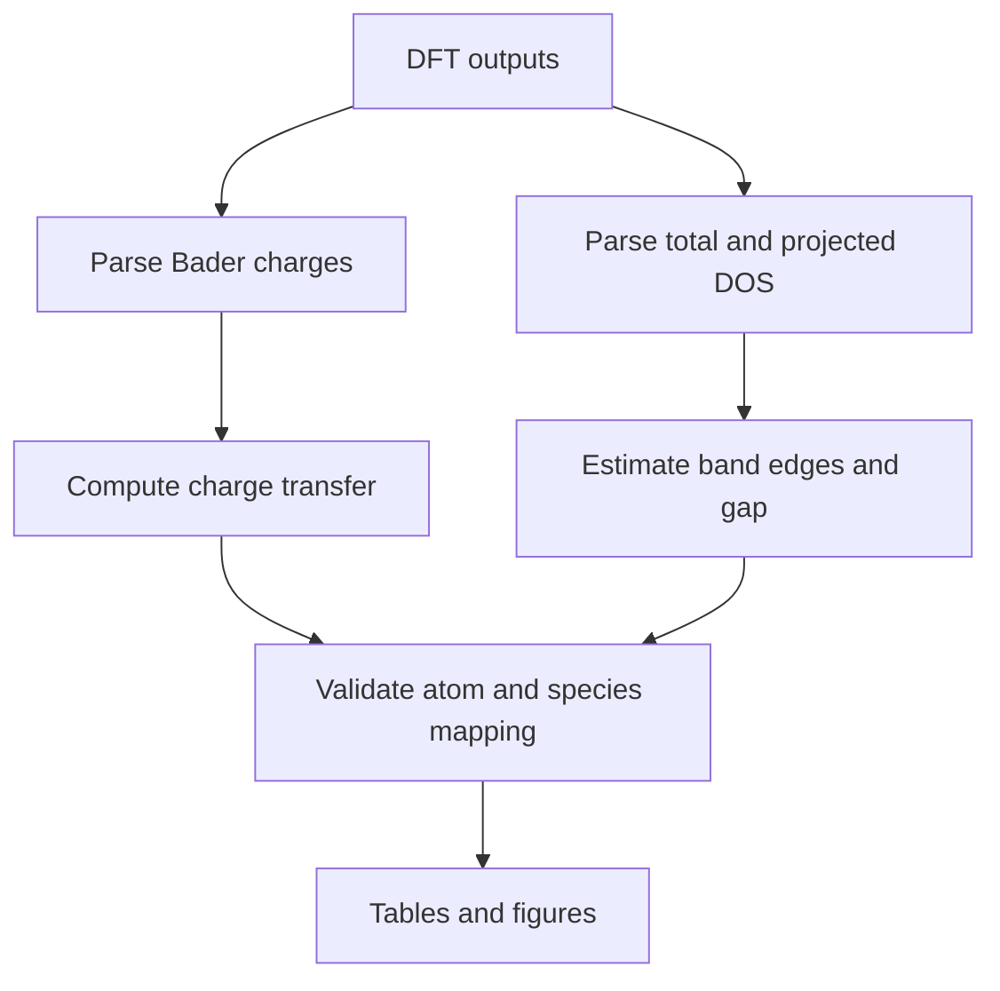

Charge arrays must map to expected atoms. Energy references and DOS thresholds must accompany any extracted gap.

## h08 — Electrochemistry

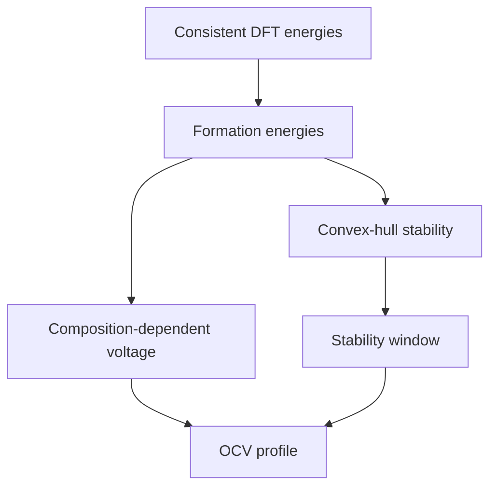

For transfer of \(n\) electrons, \(V=-\Delta G/(nF)\). If zero-temperature electronic energies approximate \(\Delta G\), that approximation must be stated.

## h09 — Continuum models

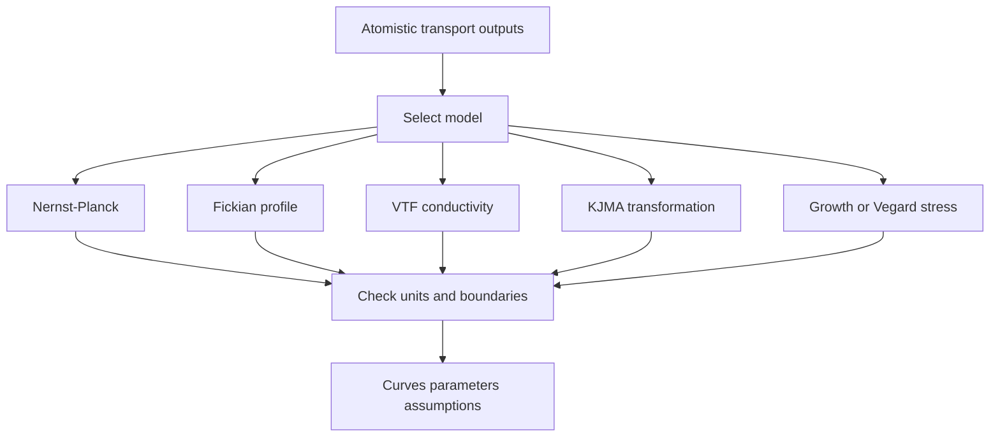

Continuum results inherit the uncertainty and domain limits of their atomistic inputs. Boundary conditions, units, parameter sources, and approximations are mandatory provenance.

## h10 — Plotting

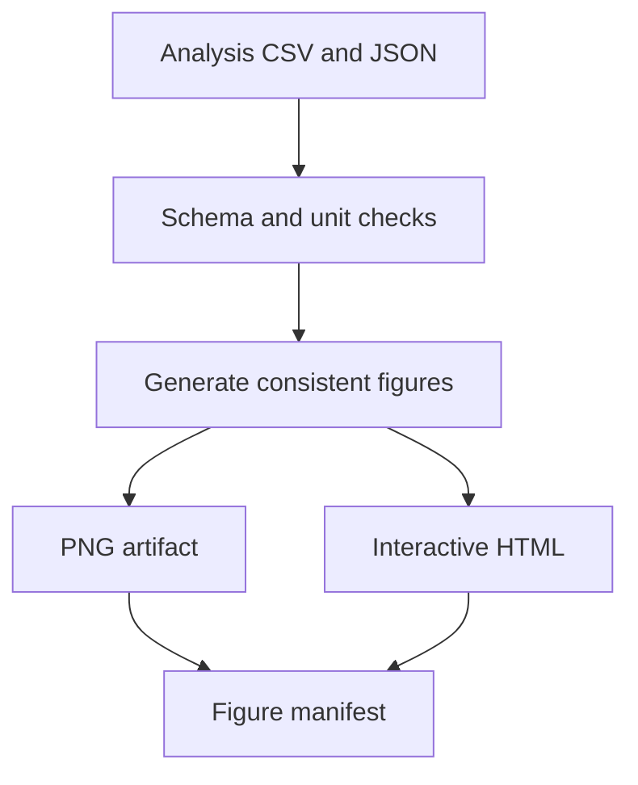

Figures remain linked to source data, axis units, transformation choices, and generation context.

## h11 — Manuscript

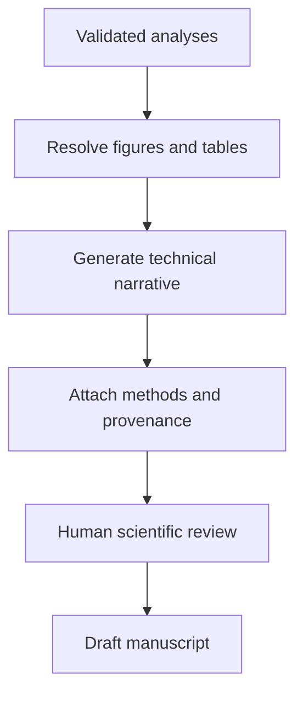

Generated prose is a draft. Claims must be traceable to validated artifacts and reviewed by a domain expert.

## h12 — Chaai adaptation

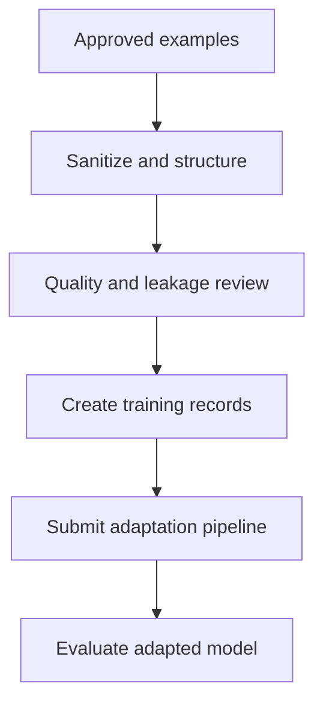

This handler is independent of the simulation chain. Only reviewed, non-sensitive examples should enter training data.

## h13 — Active learning

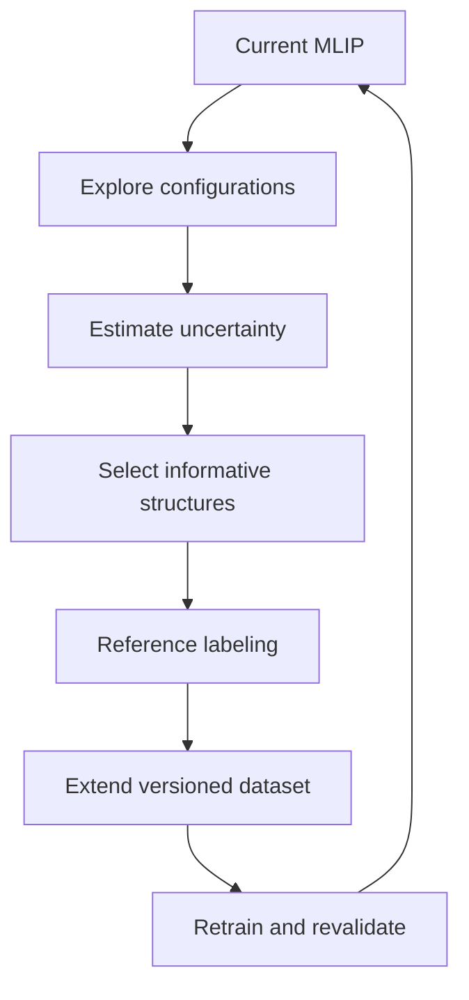

A candidate model replaces the current model only after fixed validation tests and coverage tests for the newly sampled region pass.
