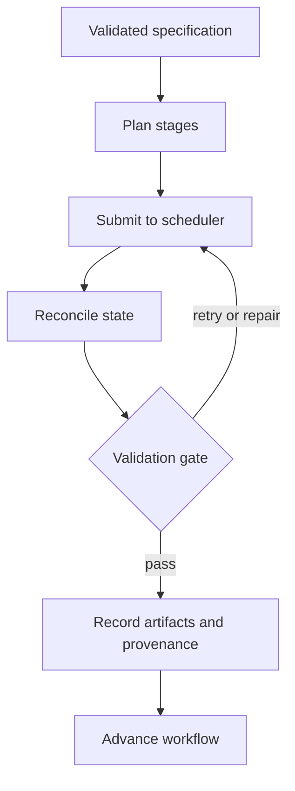

---
hide:
  - toc
---

Deterministic workflow execution

# HPCA execution engine

Turn a validated scientific specification into a restartable computational-materials workflow—with explicit stage contracts, scheduler-aware recovery, validation gates, and artifact provenance.

[Understand the architecture](architecture.md){ .md-button .md-button--primary }
[Follow the workflow](workflow-stages.md){ .md-button }

## Why HPCA exists

Long-running simulation campaigns fail in ordinary ways: queues interrupt jobs, files become incomplete, parameters drift, and results lose their connection to the inputs that produced them. HPCA makes those operational concerns part of the workflow model rather than leaving them to ad hoc scripts.

  STATE
  <h3>Restartable</h3>
  
Durable stage state allows interrupted work to resume without silently repeating valid computation.

  GATES
  <h3>Validated</h3>
  
Stage outputs advance only after structural, numerical, and domain-specific checks pass.

  TRACE
  <h3>Traceable</h3>
  
Inputs, configuration, software context, job identity, and generated artifacts remain linked.

## Execution lifecycle

HPCA can coordinate structure design, first-principles calculations, reference dynamics, machine-learned interatomic potentials, production dynamics, analysis, and reporting. The exact stages depend on the project specification and enabled backends.

!!! important "Scope of guarantees"
    HPCA improves execution integrity and traceability. It does not certify scientific correctness, replace expert review, or bypass scheduler and site policies.

## Read the engine documentation

| Topic | What it explains |
| --- | --- |
| [Architecture](architecture.md) | Components, boundaries, and control flow |
| [Workflow stages](workflow-stages.md) | Stage contracts and lifecycle progression |
| [State and recovery](state-and-recovery.md) | Restart behavior and scheduler reconciliation |
| [Provenance](provenance.md) | Traceability from inputs to reported artifacts |
| [Project specification](../reference/project-specification.md) | The validated contract supplied to execution |

  

    <h2>Need more information about HPCA?</h2>
    
Ask about workflow capabilities, integration, validation, or research collaboration.

  

  <a class="chaai-contact__button" href="mailto:selvaus10@gmail.com?subject=HPCA%20information%20request">Contact Selva</a>

