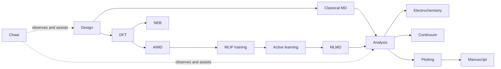

# Workflow stages

HPCA represents a study as a dependency graph of handlers. A handler owns a bounded scientific or operational responsibility and declares its prerequisites, readiness conditions, outputs, and completion test.

The actual graph is selected by material category. Solid-state-electrolyte projects place AIMD, NEB, electronic analysis, and electrochemical analysis on parallel branches after their required DFT results; molecular workflows can start classical MD immediately after design.

| Stage | Purpose | Representative gate |
|---|---|---|
| Design | Build valid structures and compositions | geometry and composition checks |
| DFT | Relax and characterize electronic structure | convergence and artifact completeness |
| AIMD | Generate high-fidelity dynamic configurations | trajectory integrity and sampling coverage |
| MLIP | Train and evaluate interatomic potentials | held-out errors and domain acceptance |
| MD | Produce statistically useful trajectories | stability, duration and ensemble checks |
| Analysis | Calculate transport and structural observables | fit quality and uncertainty reporting |
| Reporting | Produce traceable figures and summaries | source-data and provenance links |

Stages are contracts, not merely directories: each defines inputs, outputs, completion criteria, failure modes, and recovery behavior.

See the [handler reference](handlers.md) for per-handler flows and [analysis and mathematics](analysis-and-mathematics.md) for equations, assumptions, and quality gates.
