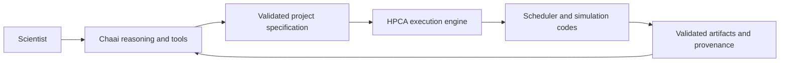

# Chaai Labs documentation

Chaai Labs develops HPC-native systems for computational science. **Chaai** provides the conversational reasoning and scientific-tool interface; **HPCA** provides validated, restartable workflow execution.

!!! note "Current maturity"
    Chaai is a working research prototype deployed on HPC. HPCA is a deterministic workflow engine under active development. Neither label is a substitute for site authorization, scientific review, or validation of a specific result.

Start with the [system overview](getting-started/overview.md) or the [first workflow](getting-started/first-workflow.md).

