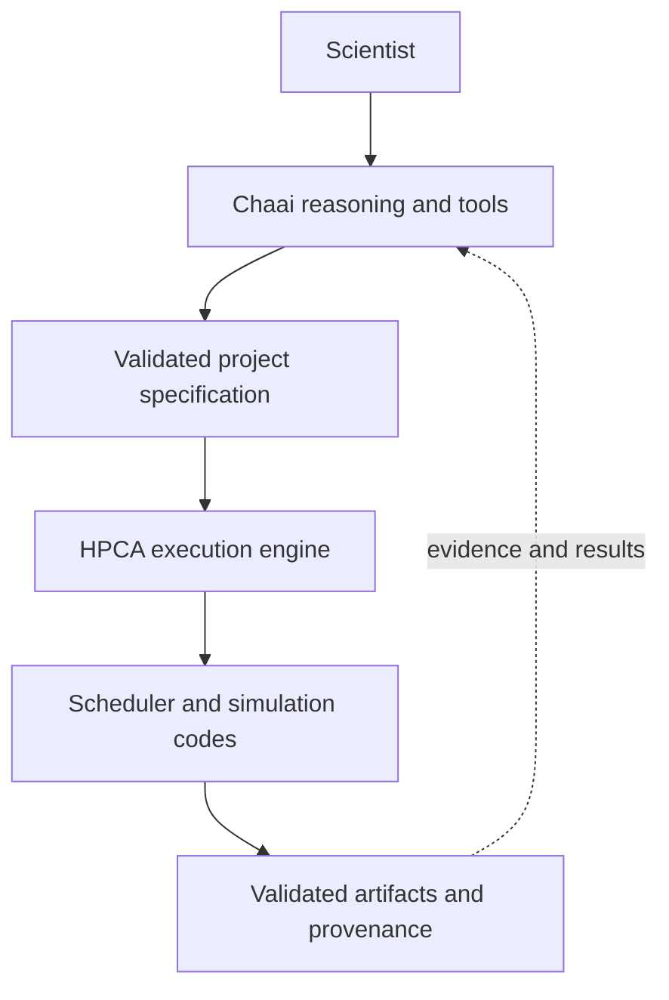

---
hide:
  - toc
---

HPC-native scientific infrastructure

# From scientific intent to validated execution

Chaai Labs connects agentic reasoning, simulation tools, and durable HPC workflows. **Chaai** provides the scientific interface; **HPCA** turns validated specifications into restartable, traceable execution.

[Start with the overview](getting-started/overview.md){ .md-button .md-button--primary }
[Explore HPCA](hpca/index.md){ .md-button }
[← Main Chaai Labs website](https://chaailabs.github.io/){ .md-button }

  01
  <h3>Chaai</h3>
  
Conversational scientific reasoning connected to schedulers, files, structures, simulation codes, and analysis tools.

  <a class="chaai-card__link" href="chaai/">Explore the agent →</a>

  02
  <h3>HPCA engine</h3>
  
Deterministic stage contracts, durable state, scheduler reconciliation, validation gates, and provenance.

  <a class="chaai-card__link" href="hpca/">Explore the engine →</a>

  03
  <h3>Scientific workflows</h3>
  
Composable workflows for battery materials and machine-learned interatomic-potential lifecycles.

  <a class="chaai-card__link" href="workflows/battery-materials/">View workflows →</a>

  04
  <h3>Operations</h3>
  
Observe workflow state, reconcile scheduler jobs, diagnose failures, and recover without losing evidence.

  <a class="chaai-card__link" href="operations/observability/">Open the runbook →</a>

## One system, explicit responsibilities

!!! note "Current maturity"
    Chaai is a working research prototype deployed on HPC. HPCA is a deterministic workflow engine under active development. Neither label is a substitute for site authorization, scientific review, or validation of a specific result.

## Choose your path

| If you want to… | Start here |
| --- | --- |
| Understand the complete system | [System overview](getting-started/overview.md) |
| Walk through execution safely | [First workflow](getting-started/first-workflow.md) |
| Understand trust boundaries | [Safety model](getting-started/safety.md) |
| Integrate a scientific backend | [Tools and backends](chaai/tools-and-backends.md) |
| Understand recovery and restart | [HPCA state and recovery](hpca/state-and-recovery.md) |
| Inspect traceability guarantees | [HPCA provenance](hpca/provenance.md) |
| Diagnose a stuck or failed run | [Troubleshooting](operations/troubleshooting.md) |
| Understand generated analysis data | [Analysis output reference](reference/analysis-outputs.md) |

  

    <h2>Questions or documentation feedback?</h2>
    
Report unclear guidance, request information, or suggest a scientific workflow improvement.

  

  <a class="chaai-contact__button" href="mailto:selvaus10@gmail.com?subject=Chaai%20Labs%20documentation%20feedback">Email Selva</a>

