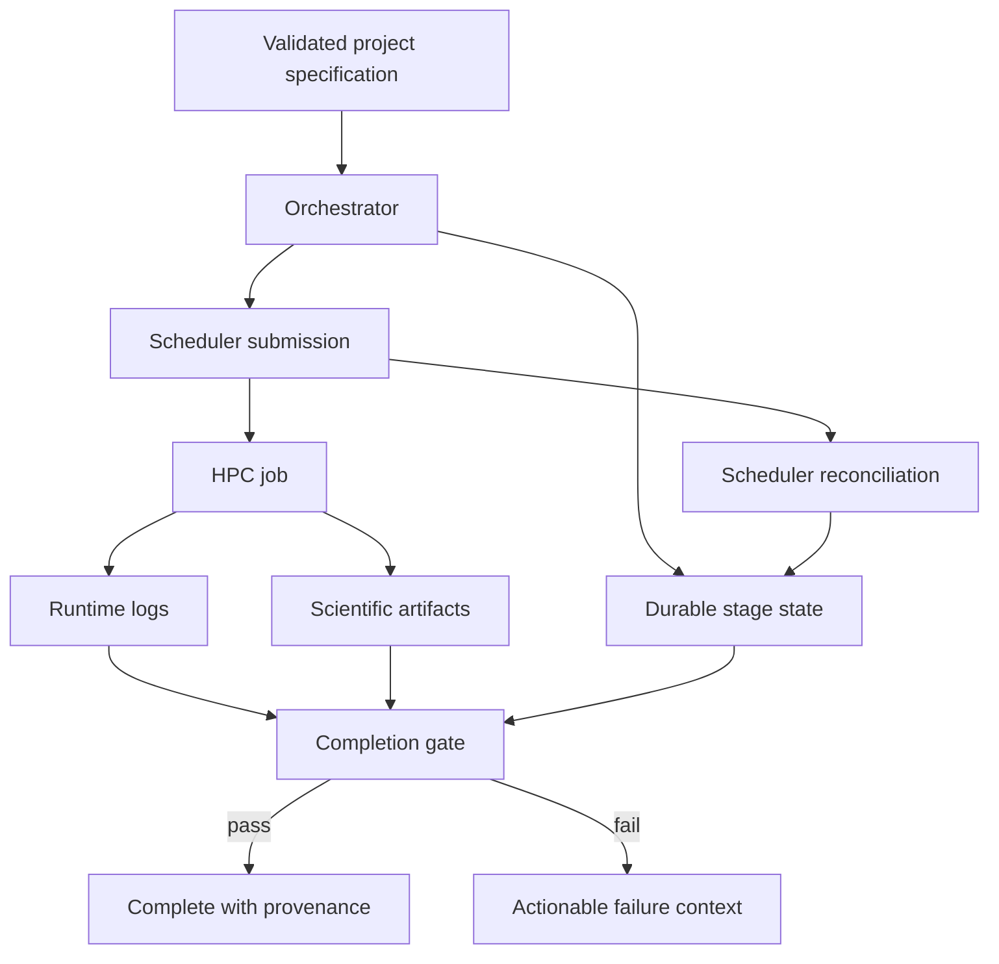
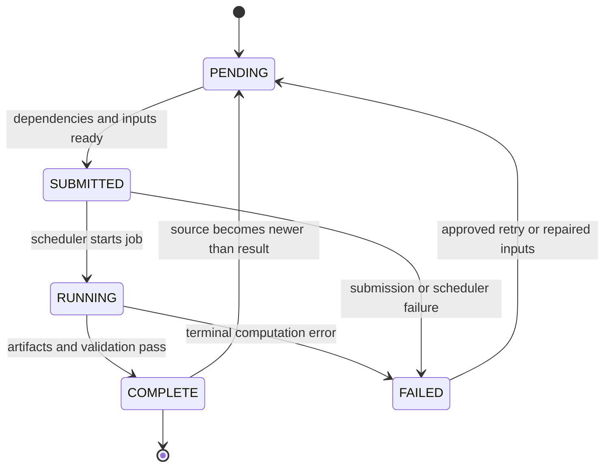

# Observability and run health

Operational visibility answers four questions: **what was requested, what is running, what changed, and what evidence supports completion?** HPCA combines durable stage state, scheduler reconciliation, structured artifacts, and project logs to answer them.

## Operational data flow

## What to inspect

| Signal | Healthy evidence | Warning evidence |
| --- | --- | --- |
| Project state | expected progression through enabled handlers | repeated transitions, stale running state |
| Scheduler identity | recorded job identifier maps to one submitted job | missing or ambiguous job identity |
| Scheduler state | queued, running, or terminal state reconciles with HPCA | scheduler terminal but HPCA still running |
| Runtime log | timestamps and normal progress continue | no output, repeated restart, fatal pattern |
| Artifacts | expected files are non-empty and parseable | partial, stale, or malformed files |
| Scientific gate | convergence and domain checks pass | files exist but convergence is absent |
| Provenance | inputs, versions, parameters, and outputs are linked | result cannot be traced to its inputs |

## Handler state model

Daemon-local handlers may move from pending to running and complete without a scheduler job. The same principle still applies: completion requires evidence, not merely a zero process exit code.

## Freshness and idempotency

A reusable result is valid only when:

1. its declared inputs and configuration match the current request;
2. required artifacts exist and pass their validation gates;
3. no source artifact is newer than the derived result;
4. the recorded software and method context remains acceptable.

If any condition fails, HPCA should recompute or require review. This prevents stale derived data from appearing complete after an upstream trajectory changes.

## Minimum incident record

When a handler fails, retain:

- project and handler identity;
- attempt number and timestamps;
- scheduler job identity when applicable;
- normalized terminal state;
- command or entry point without secrets;
- relevant log excerpt;
- expected and observed artifacts;
- validation failure;
- recovery decision and reviewer.

See [State and recovery](../hpca/state-and-recovery.md) for restart behavior and [Troubleshooting](troubleshooting.md) for symptom-driven actions.
