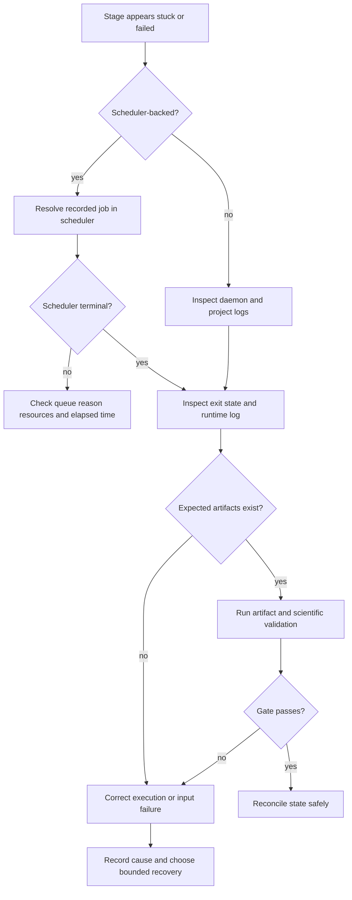

# Troubleshooting

Use this guide to diagnose a workflow without destroying valid state or obscuring the original failure. Preserve logs and artifacts before changing inputs.

## Triage flow

## Symptom matrix

| Symptom | Likely causes | Safe next check |
| --- | --- | --- |
| Stage remains pending | unmet dependency, disabled stage, missing input | compare enabled graph with recorded upstream states |
| Submitted but no job | submission failure or lost identifier | inspect submission log and recorded job identity |
| Job queued unusually long | resource request, reservation, priority, dependency | inspect scheduler reason; do not resubmit blindly |
| Job completed but stage is running | reconciliation delay or missing completion gate | compare scheduler terminal state and expected artifacts |
| Output files exist but stage failed | convergence or parse gate failed | inspect the specific validator and final log section |
| Analysis reports no trajectory | path, size, temperature, or freshness criteria not met | verify source variant and trajectory metadata |
| MSD is noisy or non-linear | insufficient sampling, wrapped coordinates, wrong species | inspect unwrapping, selection, time base, and fit window |
| Arrhenius fit is poor | too few temperatures or multiple mechanisms | inspect residuals and split scientifically justified regimes |
| RDF never approaches unity | normalization, volume, sampling, or selection error | verify cell volume, pair counts, and periodic boundaries |
| Figure is present but stale | source data newer than generated artifact | regenerate from the recorded source table |

## Recovery rules

!!! danger "Do not repair state by deleting evidence"
    Do not remove state files, scheduler logs, or failed outputs merely to make a stage rerun. Record the failure, preserve the evidence, and use the narrowest supported retry path.

1. Identify the failing handler and exact attempt.
2. Reconcile scheduler state before assuming the job vanished.
3. Determine whether the cause is input, infrastructure, software, or scientific validation.
4. Correct only the cause within the affected handler scope.
5. Retry with a bounded attempt count.
6. Confirm that upstream artifacts were not modified unexpectedly.
7. Re-run the completion gate and record the recovery.

## Analysis-specific checks

Before accepting transport results, verify:

- coordinates are unwrapped;
- the mobile-ion mapping is correct;
- the timestep and dump interval produce the stated frame time;
- equilibration removal and fitting windows are recorded;
- multiple time origins or blocks give stable estimates;
- unit conversions are dimensionally consistent;
- mixed trajectory sources are disclosed;
- CSV data and plots agree.

See [Analysis and mathematics](../hpca/analysis-and-mathematics.md) for equations and the complete acceptance matrix.

  

    <h2>Still need help?</h2>
    
Include the handler name, observed state, expected outcome, and a sanitized error summary.

  

  <a class="chaai-contact__button" href="mailto:selvaus10@gmail.com?subject=HPCA%20support%20request">Request help</a>

