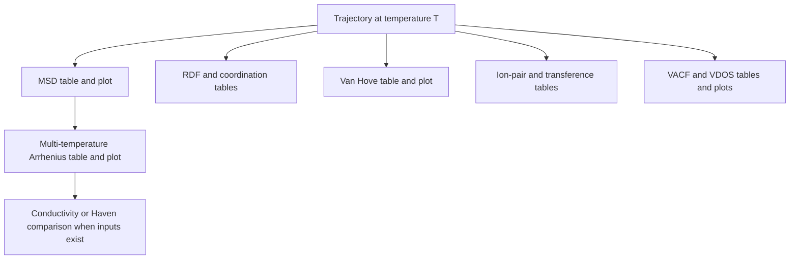

# Analysis output reference

The analysis handler writes machine-readable data next to visual artifacts. Exact availability depends on trajectory contents, configured species, and enabled analysis branches.

## Output map

## Core artifacts

| Artifact pattern | Principal fields | Interpretation |
| --- | --- | --- |
| `msd_<T>K.csv` | time in ps, MSD in Ų | displacement curve used for diffusion fitting |
| `arrhenius.csv` | temperature, \(D\), \(\ln D\), \(1/T\), \(E_a\) | multi-temperature transport fit |
| `rdf_<...>_<T>K.csv` | radius, \(g(r)\) | partial radial structure |
| `coordination_<T>K.csv` | radius and running coordination | integrated local environment |
| `van_hove_<T>K.csv` | radius and lag-dependent \(G_s\) | displacement distribution |
| `ion_pairs_<T>K.csv` | association classes or fractions | cation–anion association statistics |
| `transference_<T>K.csv` | species diffusivities and \(t_+\) | independent-particle transference estimate |
| `vacf_<T>K.csv` | lag time and normalized VACF | velocity decorrelation |
| `vdos_<T>K.csv` | frequency and spectral intensity | Fourier-domain vibrational proxy |

`<T>` denotes temperature in kelvin. Names may include species or variant identifiers when needed to avoid ambiguity.

## Provenance fields

Every reported observable should be traceable to:

| Category | Required information |
| --- | --- |
| Source | trajectory path or stable identifier and source variant |
| Physics | simulation method, ensemble, temperature, pressure when relevant |
| Sampling | timestep, dump interval, frame count, equilibration removal |
| Selection | atom types, elements, charges, and grouping rule |
| Method | equation, normalization, cutoffs, bins, fit interval |
| Software | HPCA revision and relevant backend versions |
| Quality | validation status, fit diagnostics, warnings, uncertainty |
| Product | data-table checksum and generated-figure identity |

## Consumer contract

Downstream plotting, continuum, and manuscript stages should consume the table rather than digitizing the figure. Consumers must:

1. validate the schema and units;
2. retain the source variant and temperature;
3. reject missing or non-finite required values;
4. propagate warnings and uncertainty;
5. avoid combining methods without an explicit comparison design.

For mathematical definitions, see [Analysis and mathematics](../hpca/analysis-and-mathematics.md). For artifact lineage, see [Provenance](../hpca/provenance.md).
