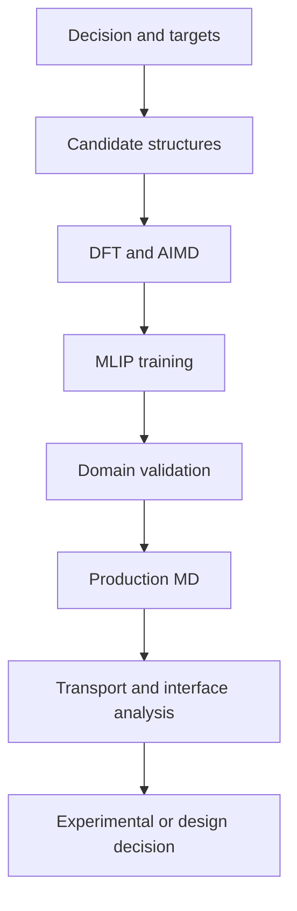

# Battery-materials workflow

The reference workflow connects a decision to a fidelity ladder:

Validation must reflect the intended operating domain: composition, phase, temperature, strain, defects, interfaces and reaction states. Random frame splits are insufficient when adjacent trajectory frames are correlated.
